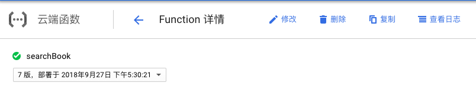
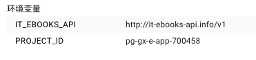

# nodejs-serverless-framework

Node.js Serverless Framework Code Lab

## 说明

- 使用`@google-cloud/functions-emulator`编写集成测试和系统测试，`@google-cloud/functions-emulator`用来模拟`cloud function`的部署环境，在本地部署`cloud function`，
  相比部署到`GCP`上，拥有更快的部署速度，在开发过程中，会执行大量测试，部署到本地，可以节省`GCP`流量。但该模块 bug 实在太多，文档也不全，耗费了大量时间。比如部署`CF`时传递环境变量，官方文档并
  没有说明。

- 使用`serverless framework`统一管理不同`SaaS`上的`cloud function`及其相关资源，例如`GCP pub/sub`的`topic`，环境变量等, 只需配置好`serverless.yml`文件，执行一条命令，即可一键部署或删除所有`cloud function`及其相关资源到各`SaaS`。
  管理起来很方便。

- 各`cloud function`的环境变量也由`serverless framework`统一管理。通过`serverless-dotenv-plugin`插件，即可加载项目根目录下的`.env`中列出的所有环境变量。可以很好的与`Docker`集成。
  在`serverless.yml`文件中，可以配置全局环境变量和针对每个`cloud function`的环境变量。

## docker

build docker image

`docker build -t nodejs-sls:v1.0.0 .`

指定环境变量文件，并执行部署脚本:

`docker run --env-file ./.env.production -v ~/workspace/nodejs-serverless-framework/.gcp/:/app/.gcp sls:v1 npm run deploy`

```bash
☁  nodejs-serverless-framework [master] ⚡  docker run --env-file ./.env.production -v ~/workspace/nodejs-serverless-framework/.gcp/:/app/.gcp sls:v1 npm run deploy

> nodejs-serverless-framework@1.0.0 deploy /app
> SLS_DEBUG=* serverless deploy --verbose

Serverless: Load command config
Serverless: Load command config:credentials
Serverless: Load command create
Serverless: Load command install
Serverless: Load command package
Serverless: Load command deploy
Serverless: Load command deploy:function
Serverless: Load command deploy:list
Serverless: Load command deploy:list:functions
Serverless: Load command invoke
Serverless: Load command invoke:local
Serverless: Load command info
Serverless: Load command logs
Serverless: Load command login
Serverless: Load command logout
Serverless: Load command metrics
Serverless: Load command print
Serverless: Load command remove
Serverless: Load command rollback
Serverless: Load command rollback:function
Serverless: Load command slstats
Serverless: Load command plugin
Serverless: Load command plugin
Serverless: Load command plugin:install
Serverless: Load command plugin
Serverless: Load command plugin:uninstall
Serverless: Load command plugin
Serverless: Load command plugin:list
Serverless: Load command plugin
Serverless: Load command plugin:search
Serverless: Load command config
Serverless: Load command config:credentials
Serverless: Load command logs
Serverless: DOTENV: Could not find .env file.
Serverless: Invoke deploy
Serverless: Invoke package
Serverless: Packaging service...
Serverless: Excluding development dependencies...
Serverless: Compiling function "searchBook"...
Serverless: Compiling function "getStarted"...
Serverless: Compiling function "bk"...
Serverless: Uploading artifacts...
Serverless: Artifacts successfully uploaded...
Serverless: Updating deployment...
Serverless: Checking deployment update progress...
.....
Serverless: Done...
Service Information
service: nodejs-serverless-framework
project: pg-gx-e-app-700458
stage: dev
region: us-central1

Deployed functions
bk
  projects/pg-gx-e-app-700458/topics/my-topic
getStarted
  https://us-central1-pg-gx-e-app-700458.cloudfunctions.net/getStarted
searchBook
  https://us-central1-pg-gx-e-app-700458.cloudfunctions.net/searchBook
```




删除所有`cloud function`及相关资源:

```bash
☁  nodejs-serverless-framework [master] ⚡  docker run --env-file ./.env.production -v ~/workspace/nodejs-serverless-framework/.gcp/:/app/.gcp sls:v2 npm run remove

> nodejs-serverless-framework@1.0.0 remove /app
> serverless remove

Serverless: DOTENV: Could not find .env file.
Serverless: Removing artifacts in deployment bucket...
Serverless: Removing deployment...
Serverless: Checking deployment remove progress...
...
Serverless: Done...
```

## 注意

本项目为了演示目的，将`.env`和`.env.production`文件上传到了`github`仓库。生产环境请将这两个文件加入`.gitignore`，通过`docker`指定`--env-file`指定环境变量文件，和`-v`挂载`GCP`的`credential`文件
